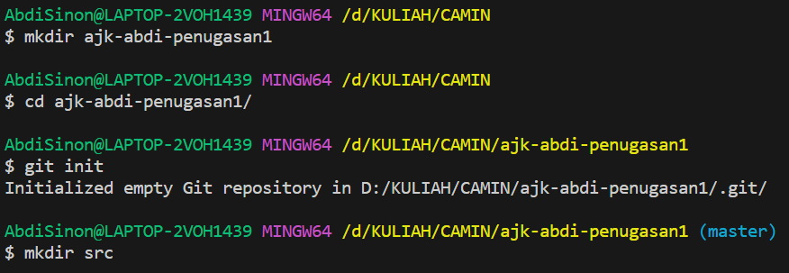
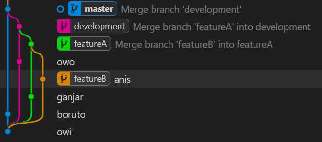
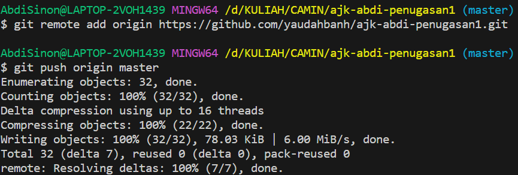
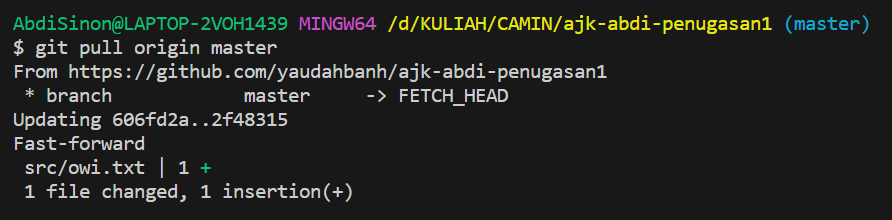
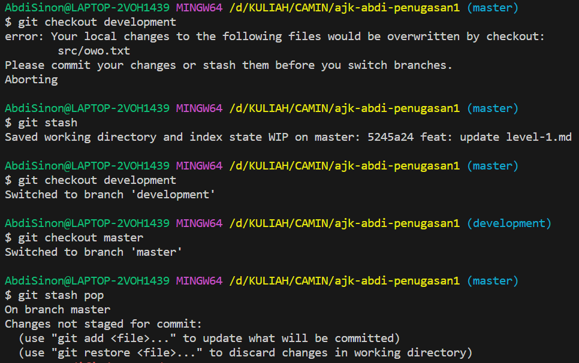
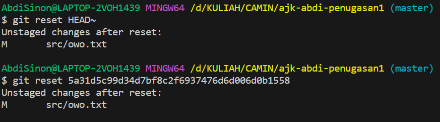
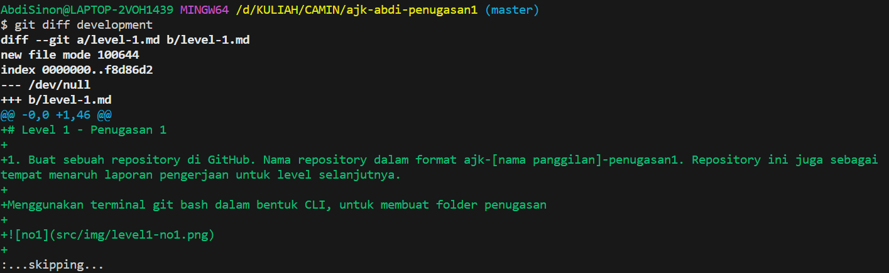
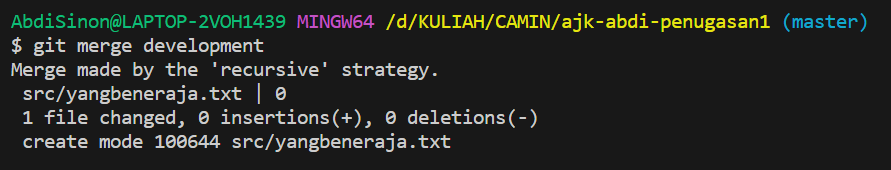
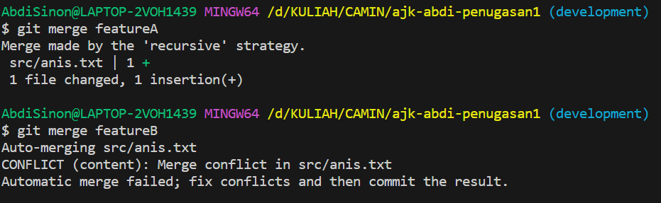
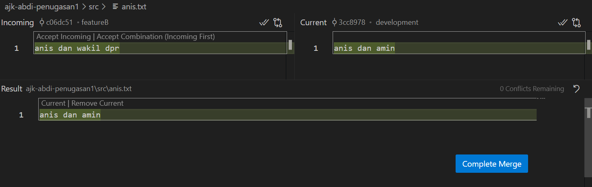

# Level 1 - Penugasan 1

1. Buat sebuah repository di GitHub. Nama repository dalam format ajk-[nama panggilan]-penugasan1. Repository ini juga sebagai tempat menaruh laporan pengerjaan untuk level selanjutnya.

Menggunakan terminal git bash dalam bentuk CLI, untuk membuat folder penugasan

2. Implementasikan penggunaan branching yang terdiri dari master, development, featureA, dan featureB. Codebase dibebaskan

Melakukan brancing dengan urutan seperti ini

- commit master
- checkout development
- branch featureA
- commit featureA
- checkout development
- branch featureB
- commit featureB
- commit development
- checkout featureA
- merge featureB
- checkout development
- merge featureA
- checkout master
- merge development

3. Implementasikan intruksi git untuk push, pull, stash, reset, diff, dan merge. Adanya tambahan intruksi git selain yang disebutkan akan lebih baik

Melakukan git push pada branch master ke remote

Melakukan git pull pada branch master, setelah ada perubahan pada file `owi.txt` pada remote

Melakukan stash pada branch master, karena tidak melakukan commit sebelum checkout pada branch lain

Melakukan git reset pada hash tertentu di file owo.txt

Melakukan git diff antara branch master dan branch development

 Melakukan git merge pada branch master dari branch development

 

 4. Implementasikan sebuah penanganan conflict di branch development ketika setelah merge dari branch featureA lalu merge dari branch featureB. 
Catatan: conflict bisa terjadi jika kedua branch mengerjakan di file dan line code yang sama. Buatlah skenario sendiri

Pada file `anis.txt` dilakukan perubahan yang berbeda pada content di antara branch featureA dan branch featureB. Lalu merge ke branch development

